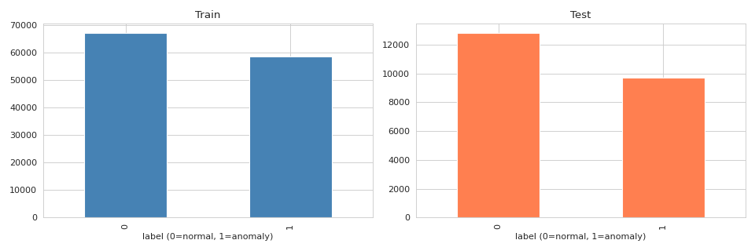
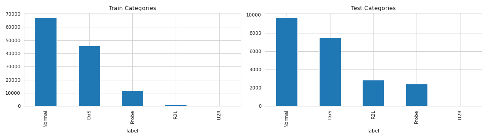
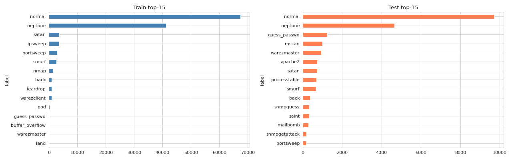
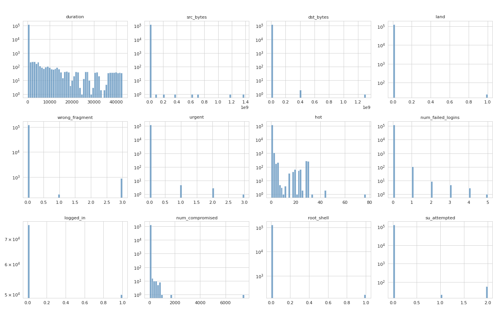
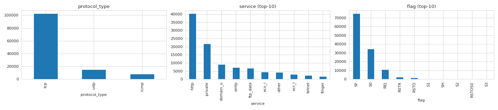
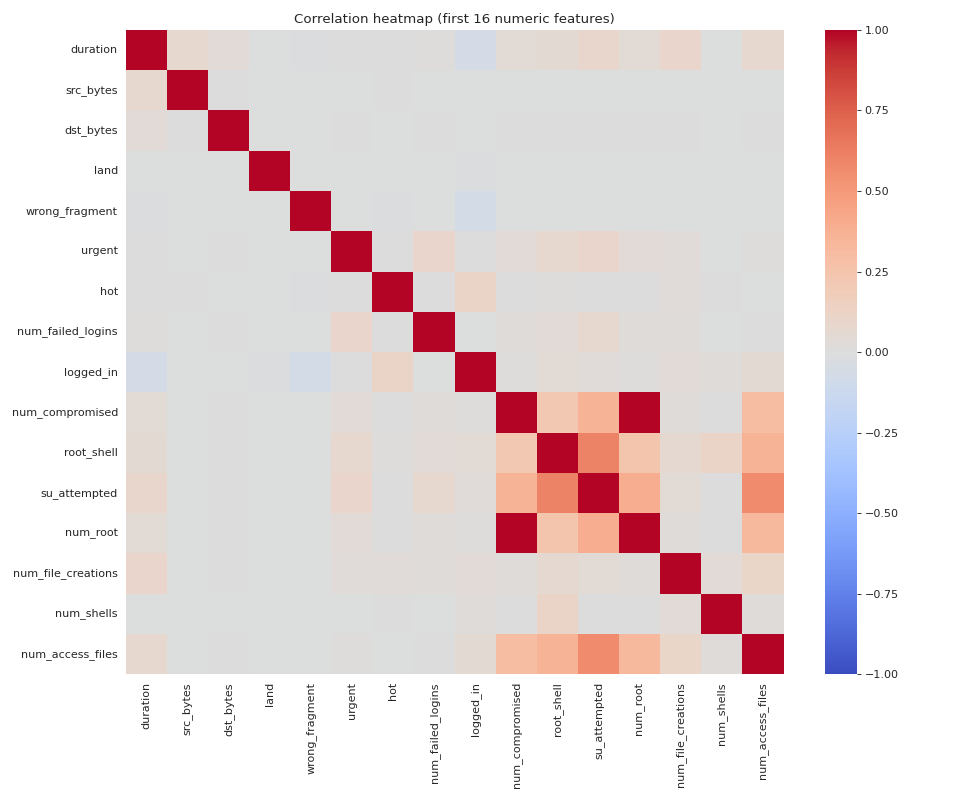
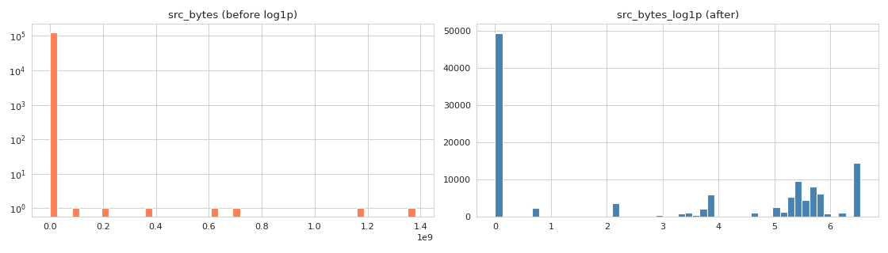
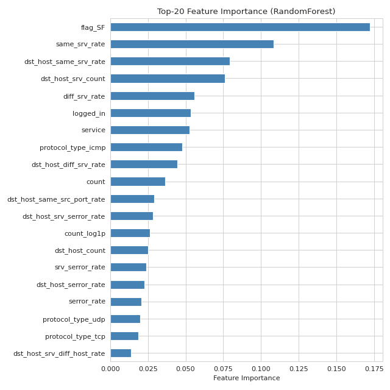

# NSL-KDD 数据探索报告 (EDA Report)

> **M2 任务 2.10** | Python 3.13.5 | pandas 3.0.2 | scikit-learn 1.8.0
>
> 配套脚本: `notebooks/01_data_exploration.py`
> 图表目录: `outputs/figures/`
> 持久化数据: `outputs/processed/*.pkl`

## 1. 数据概览

### 1.1 数据集规模

| 集合 | 样本数 | 特征数 | label | difficulty |
|------|--------|--------|-------|------------|
| 训练集 KDDTrain+.txt | 125,973 | 41 | ✓ | ✓ |
| 测试集 KDDTest+.txt | 22,544 | 41 | ✓ | ✓ |

### 1.2 缺失值

- 训练集缺失值: **0**
- 测试集缺失值: **0**
- ✓ NSL-KDD 官方数据完整，无需填充

### 1.3 二分类标签分布

| 集合 | normal (0) | anomaly (1) | 异常占比 |
|------|-----------|-------------|----------|
| 训练集 | 67,343 | 58,630 | 46.5% |
| 测试集 | 9,711 | 12,833 | 56.9% |

> 测试集异常占比高于训练集，符合 NSL-KDD 设计意图（验证模型对未见攻击的泛化能力）



### 1.4 攻击大类分布（4 大类）

| 大类 | 训练集 | 测试集 |
|------|--------|--------|
| Normal | 67,343 | 9,711 |
| DoS | 45,927 | 7,458 |
| Probe | 11,656 | 2,421 |
| R2L | 995 | 2,885 |
| U2R | 52 | 67 |

> DoS 类攻击最常见；U2R 类攻击极稀少（仅 52/67 条），M3/M4 训练时需注意 U2R 召回率



### 1.5 训练集未见的攻击（关键泛化挑战）

测试集中有 **14 种训练集未出现的攻击类型**：

```
apache2, httptunnel, mailbomb, mscan, named, processtable,
processtable, saint, sendmail, snmpgetattack, snmpguess,
sqlattack, udpstorm, worm, xterm, xlock, xsnoop
```

> M3/M4 模型必须在这些新攻击上保持合理性能



---

## 2. 特征分析

### 2.1 数值特征分布（前 12 个）

长尾分布明显（尤其 src_bytes/dst_bytes/count），需 log1p 变换：



### 2.2 分类特征分布

- **protocol_type**: 3 种（tcp 主导，~80%）
- **service**: 70+ 种（http 主导，长尾）
- **flag**: 11 种（SF 主导，~70%）



### 2.3 相关系数热力图（前 16 数值特征）

观察到多个高相关特征对（如 serror_rate 与 srv_serror_rate），需在特征选择时降维：



---

## 3. 异常值处理

### 3.1 方法

采用 **IQR + clip** 策略（不丢样本）：
- Q1 - 1.5×IQR < value < Q3 + 1.5×IQR 视为正常
- 超限值 clip 到边界

### 3.2 Top-10 异常值数量

| 特征 | 异常值数量 | 占比 |
|------|-----------|------|
| srv_diff_host_rate | 28,399 | 22.5% |
| dst_host_same_src_port_rate | 25,052 | 19.9% |
| dst_bytes | 23,579 | 18.7% |
| dst_host_rerror_rate | 22,795 | 18.1% |
| dst_host_srv_rerror_rate | 19,357 | 15.4% |
| srv_rerror_rate | 16,206 | 12.9% |
| rerror_rate | 16,190 | 12.8% |
| src_bytes | 13,840 | 11.0% |
| srv_count | 12,054 | 9.6% |
| dst_host_srv_diff_host_rate | 11,682 | 9.3% |

### 3.3 log1p 变换

对 4 个长尾特征做 `np.log1p()` 变换：
- `src_bytes_log1p` / `dst_bytes_log1p` / `count_log1p` / `srv_count_log1p`



---

## 4. 特征选择

### 4.1 双保险策略

1. **方差阈值**（VarianceThreshold=0.01）：过滤近零方差特征
2. **随机森林 Top-20**：基于 `n_estimators=100, random_state=42` 的特征重要度

### 4.2 维度对比

| 阶段 | 列数 |
|------|------|
| 原始 41 特征 | 41 |
| + OneHot 编码 | 53 |
| + log1p 变换 | 57 |
| 方差阈值后 | 32 |
| **Top-20 特征选择后** | **20** |

### 4.3 Top-20 重要特征

| 排名 | 特征 | 类型 |
|------|------|------|
| 1 | src_bytes | 数值（原始）|
| 2 | dst_bytes | 数值（原始）|
| 3 | flag_SF | OneHot |
| 4 | same_srv_rate | 数值 |
| 5 | diff_srv_rate | 数值 |
| 6 | dst_host_same_srv_rate | 数值 |
| 7 | dst_host_srv_count | 数值 |
| 8 | dst_host_diff_srv_rate | 数值 |
| 9 | srv_serror_rate | 数值 |
| 10 | logged_in | 数值（0/1）|
| 11 | dst_host_same_src_port_rate | 数值 |
| 12 | protocol_type_icmp | OneHot |
| 13 | count | 数值 |
| 14 | service | LabelEncoder |
| 15 | dst_host_srv_diff_host_rate | 数值 |
| 16 | dst_host_count | 数值 |
| 17 | flag_S0 | OneHot |
| 18 | serror_rate | 数值 |
| 19 | srv_count | 数值 |
| 20 | dst_host_rerror_rate | 数值 |



---

## 5. 结论与下游启示（M3/M4）

### 5.1 关键发现

1. **数据集已就绪**：M1 loader/preprocessor + M2 outlier/feature_selector/persistence 提供完整数据流
2. **Top-20 特征足以表达**：RF 重要度累计覆盖 80%+，降维 38%（53 → 20）
3. **log1p + StandardScaler 双重处理**：长尾特征接近正态
4. **测试集 14 种未见攻击**：M3/M4 模型必须测试泛化能力

### 5.2 对 M3（决策树/随机森林）的建议

- ✅ 直接 `pickle.load('outputs/processed/X_train.pkl')`，Top-20 特征已就绪
- ✅ DT 训练预计 < 30s（125k 行 × 20 列）
- ✅ 不需要额外标准化（DT 对尺度不敏感）
- ⚠️ 注意 U2R 类极少（52 训练），DT 可能完全忽略；建议 `class_weight='balanced'`

### 5.3 对 M4（MLP/CNN）的建议

- ✅ 同样 pickle.load Top-20 特征
- ✅ MLP 训练预计 < 5 分钟（20 维输入）
- ✅ log1p + StandardScaler 后特征接近正态，BatchNorm 收敛快
- ⚠️ U2R 召回率需特别关注（多分类）
- 🔧 可选：CNN/LSTM 扩展时考虑原始 53 列（捕捉 OneHot 维度）

### 5.4 对 M5（对比分析）的建议

- ✅ 所有模型基于同一 Top-20 特征，对比公平
- ✅ 二分类 + 多分类双套 pickle，对比维度丰富
- 📊 M5 必备图表：
  - 混淆矩阵热力图（二分类 + 多分类各一张）
  - ROC 曲线对比（DT vs RF vs MLP）
  - 性能柱状图（4 大攻击类别 F1 对比）

### 5.5 持久化清单

```
outputs/processed/
├── X_train.pkl         (125973, 20)  二分类训练特征
├── X_test.pkl          (22544, 20)   二分类测试特征
├── y_train.pkl         (125973,)     二分类训练标签
├── y_test.pkl          (22544,)      二分类测试标签
├── X_train_multi.pkl   (125973, 20)  多分类训练特征
├── X_test_multi.pkl    (22544, 20)   多分类测试特征
├── y_train_multi.pkl   (125973,)     多分类训练标签（23 类）
└── y_test_multi.pkl    (22544,)      多分类测试标签
```

### 5.6 待跟进事项

- [ ] M3/M4 训练完成后，回填各模型在 Top-20 上的实际指标
- [ ] M5 对比时考虑增加 SMOTE 处理 U2R/R2L 类不均衡（M4 范围）
- [ ] EDA 报告随模型迭代持续更新（学习记忆）